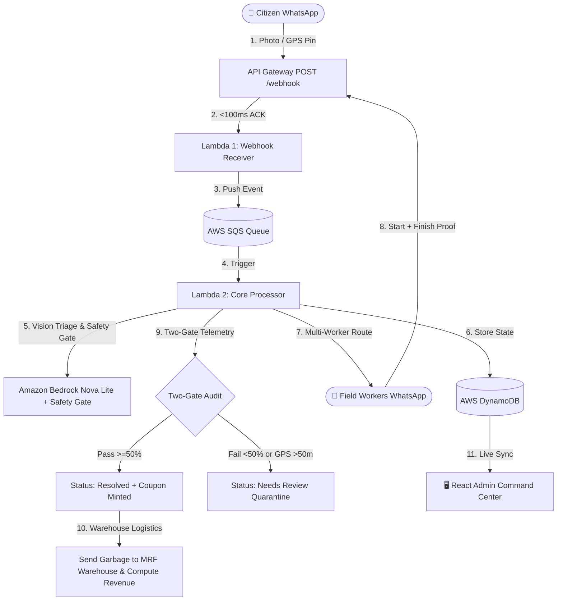

# 🚀 PingBin — Intelligent Municipal Logistics & Verification Network

> **PS-03: Intelligent Waste Collection & Municipal Logistics Network (HACQUIRE 2026)**  
> **Live Command Center:** Real-Time React (Vite) + Tailwind CSS + shadcn/ui Dashboard  
> **Backend Architecture:** Serverless Event-Driven AWS Lambda (2 Handlers) + AWS SQS + Amazon Bedrock Nova Lite + AWS DynamoDB

---

## 🎯 Executive Overview

**PingBin** is an enterprise-grade municipal waste triage, workforce dispatch, and anti-fraud verification platform.

It solves urban sanitation challenges at the source:
1. **Zero Citizen Friction:** Citizens report illegal waste piles in seconds via **native WhatsApp** (photo + live location pin) — no custom mobile apps to download or register for.
2. **Sub-500ms Webhook Ingestion:** Twilio webhooks are acknowledged instantly via serverless AWS SQS decoupling, eliminating 15-second webhook timeout failures.
3. **Multimodal AI Vision & Safety Gate:** AWS Bedrock Nova Lite triages waste category, fill percentage, urgency, and estimated cleanup time, with automated low-confidence gating (`<25%`) and suspicious image detection via [`modules/safety-gate/`](modules/safety-gate/).
4. **Dynamic Multi-Worker Dispatch:** Automatically computes required workforce ($1-4$ staff) and assigns nearest available field units using Haversine geospatial proximity.
5. **Two-Gate Anti-Fake-Work Telemetry:** Eliminates worker fraud via mathematical **Gate A (Spatial Proximity $\le 50\text{m}$)** and **Gate B (Temporal Duration $\ge 50\%$ of estimated work)** before any report is marked resolved via [`modules/truth-verification-engine/`](modules/truth-verification-engine/).
6. **Hyperlocal Merchant Gamification:** Automatically mints collision-resistant merchant discount coupons (`CL-{PREFIX}-{RAND}-{DISCOUNT}`) for citizens upon verified cleanup via [`modules/reward-engine/`](modules/reward-engine/).
7. **Warehouse Service & Materials Recovery (MRF) Integration:** After cleanup is verified, routes the collected garbage to specialized recycling warehouses (MRFs) for circular recycling and computes municipal revenue via [`modules/recycling-categorizer/`](modules/recycling-categorizer/).

---

## 💡 Why WhatsApp Beats Custom Municipal Apps

| Approach | Adoption Limitation | PingBin's Advantage |
|---|---|---|
| **Custom Mobile Apps** | Requires app store download, permissions, login, and updates — high friction kills civic pilots. | **WhatsApp Native:** 2-tap photo + location sharing. 500M+ existing active users. |
| **Municipal IoT Hardware** | Requires expensive fixed bin sensors, solar hardware, and continuous maintenance. | **Zero Hardware Capex:** Citizen phone acts as the sensor; AI extracts state from imagery. |
| **Manual Worker Checkoff** | Workers can self-certify completions remotely without performing actual work. | **Two-Gate Deterministic Verification:** Mathematical GPS lock ($\le 50\text{m}$) + time plausibility audit ($\ge 50\%$). |

---

## 🏗️ Architecture & Core Loop



---

## 📦 System Modules & Feature Components

For deep-dive technical specifications and M&A audit details, see:
- 📄 [`MODULES.md`](MODULES.md) — Master index and single source of truth
- 📄 [`TRADABLE_ASSETS.md`](TRADABLE_ASSETS.md) — Sell-side packaged IP catalog
- 📄 [`ACQUIRED_ASSETS.md`](ACQUIRED_ASSETS.md) — Buy-side M&A audit & delivery status

### Modules Table

| Item | Category | Location | Origin | Live Status |
|---|---|---|---|:---:|
| **Safety Gate (confidence/suspicious/segregation check)** | 🛠️ In-house standalone module | [`modules/safety-gate/`](modules/safety-gate/) | Replaces undelivered Heavy Coding acquisition | 🟢 **LIVE** |
| **Warehouse Routing & Recycling Logistics Module** | 🛠️ In-house standalone module | [`modules/recycling-categorizer/`](modules/recycling-categorizer/) | Replaces undelivered ANOMALY acquisition | 🟢 **LIVE** |
| **Truth Score Verification Engine** | 🔄 Tradable IP / Built In-House | [`modules/truth-verification-engine/`](modules/truth-verification-engine/) | Built in-house (`MOD-TRUTH-VERIFY-01`, asking ₹4.50–5.00 Cr) | 🟢 **LIVE** |
| **Dynamic Vendor & Auto-Coupon Engine** | 🔄 Tradable IP / Built In-House | [`modules/reward-engine/`](modules/reward-engine/) | Built in-house (`MOD-REWARD-ENGINE-02`, asking ₹3.50–4.00 Cr) | 🟢 **LIVE** |
| **WhatsApp Intake & Webhook Decoupler** | 🔄 Tradable IP / Built In-House | [`modules/whatsapp-intake/`](modules/whatsapp-intake/) | Built in-house (`MOD-WHATSAPP-INTAKE-03`, asking ₹3.00–3.50 Cr) | 🟢 **LIVE** |

---

## 🛠️ Verification & Testing

### 1. Run Standalone Module Tests
```bash
# Test 1: Safety Gate Engine
PYTHONPATH=modules/safety-gate backend/.venv/bin/python3 -c "
from safety_gate import evaluate_safety_gate
res = evaluate_safety_gate({'is_valid_report': True, 'confidence': 90, 'suspicious_flag': False})
print('✅ Safety Gate Test:', res['status'], f'(Passed: {res[\"passed\"]})')
assert res['passed'] == True
"

# Test 2: Warehouse Routing & Recycling Logistics
PYTHONPATH=modules/recycling-categorizer backend/.venv/bin/python3 -c "
from categorizer import categorize_for_recycling
res = categorize_for_recycling('')
print('✅ Warehouse Logistics Test:', res['recycling_category'], f'Purity: {res[\"purity_score\"]}%')
assert res['recycling_category'] == 'mixed'
"

# Test 3: Truth Score Verification Engine
PYTHONPATH=modules/truth-verification-engine backend/.venv/bin/python3 -c "
from verifier import verify_work
res = verify_work({'estimated_minutes': 40, 'actual_minutes': 35, 'start_lat': 20.35, 'start_lng': 85.81, 'end_lat': 20.3501, 'end_lng': 85.8101})
print('✅ Verifier Test:', res['status'], f'(Truth: {res[\"truth_percentage\"]}%)')
assert res['status'] == 'resolved'
"

# Test 4: Dynamic Reward Engine
PYTHONPATH=modules/reward-engine backend/.venv/bin/python3 -c "
from reward import generate_reward
res = generate_reward([{'vendor_name': 'BigBasket', 'discount_percent': 10}])
print('✅ Reward Test:', res['selected_vendor'], 'Code:', res['coupon_code'])
assert 'CL-BIG-' in res['coupon_code']
"

# Test 5: WhatsApp Intake Webhook Handler
PYTHONPATH=modules/whatsapp-intake backend/.venv/bin/python3 -c "
from handler import handle_webhook
res = handle_webhook({'body': 'From=whatsapp%3A%2B919084686979&Body=PingBin'})
print('✅ WhatsApp Intake Test:', res['statusCode'])
assert res['statusCode'] == 200
"
```

### 2. Run Comprehensive 7-Scenario End-to-End Test Suite
```bash
cd frontend && npx playwright test tests/e2e/comprehensive_scenario_tests.spec.ts --workers=1 --reporter=list
```
